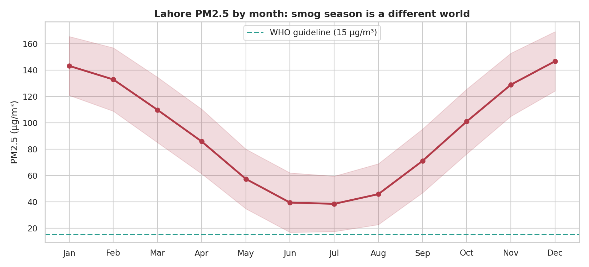
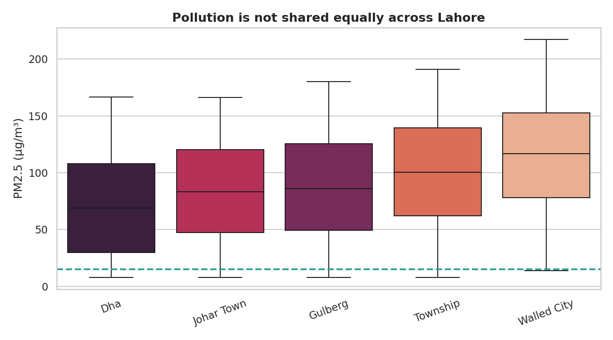
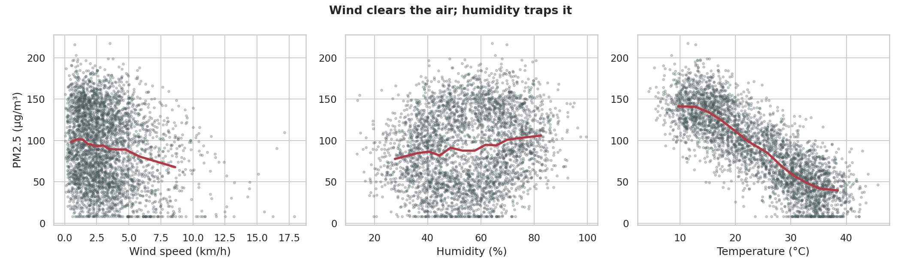
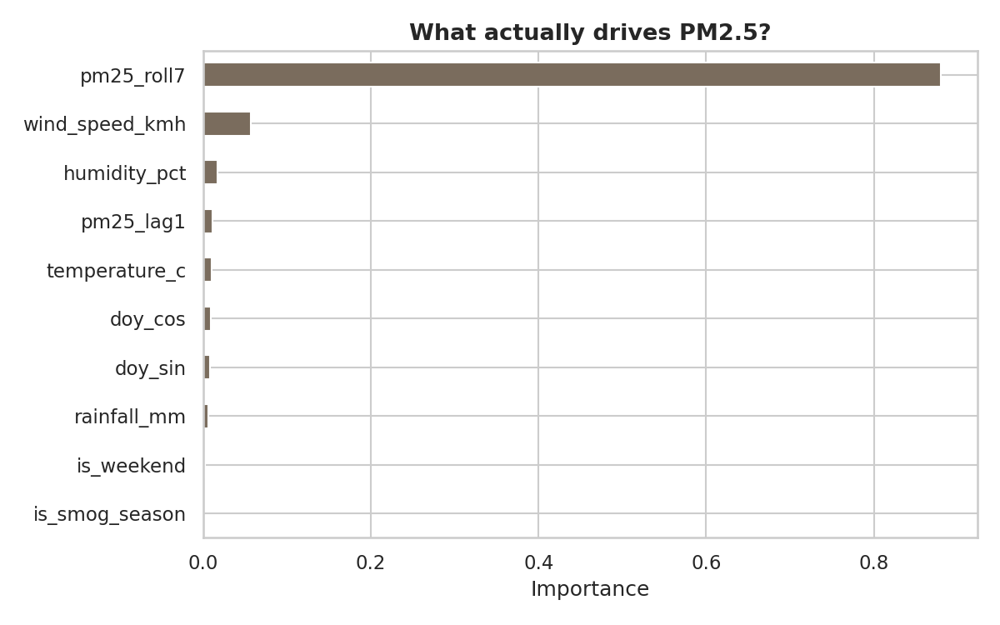

# Lahore Air Quality: What Actually Drives the Smog?

An end-to-end analysis of two years of PM2.5 readings from five monitoring stations across Lahore, from messy raw sensor data through to validated predictive models.

**Implemented twice, in both Python and R**, to demonstrate equivalent workflows in each language.

---

## The short version

Lahore's air is bad. But *how* bad, *when*, and *why* are questions worth answering precisely.

| Finding | Number |
|---|---|
| Mean PM2.5 across all stations | **91.2 µg/m³** |
| Multiple of the WHO 24-hour guideline | **6.1×** |
| Days exceeding the WHO guideline | **95.4%** |
| Smog season (Nov–Feb) average | **138.0 µg/m³** |
| Rest of year average | **68.3 µg/m³** |
| Smog season penalty | **2.0× worse** |

Three things came out of the modelling that I did not expect going in:

1. **Wind is the single most powerful weather lever.** Not temperature, not rainfall. Wind speed. Each additional km/h of wind measurably clears the air.
2. **Pollution is not shared equally.**  The gap between the cleanest and dirtiest neighbourhood is large enough that residents are effectively breathing different air.
3. **The simple model won.** Linear regression outperformed Random Forest (R² 0.724 vs 0.647),and the reason is the most interesting thing in this project. I explain it below.

---

## Figures

### The seasonal cycle


Smog season is not a gradual worsening; it is a step change. The shaded band is ±1 SD, and even the *good* days in December are worse than the *bad* days in August.

### Not everyone breathes the same air


Every station, in every month, sits above the WHO guideline. But the spread between them is the story: this is an environmental justice finding, not just an air quality one.

### What weather does to the air


Wind disperses; humidity traps. The relationship with wind is strong and close to monotonic, which turns out to matter for model choice.

### What the model actually learned


---

## Why linear regression beat Random Forest

This is the part I would want an interviewer to ask about.

The instinct is to reach for the flexible model. But Random Forest lost, and it lost for a legible reason: **the underlying relationships here are close to linear.** Wind clears the air at a roughly constant rate. Yesterday's PM2.5 predicts today's in an almost straight line. When the true signal is linear, a tree ensemble spends its capacity approximating straight lines with staircases, adding variance without reducing bias.

The lesson generalises: *model complexity should be earned, not assumed.* I keep both models in the pipeline precisely so the comparison is visible rather than hidden.

---

## Validation: why the split matters

The models are validated with **`TimeSeriesSplit`, not random k-fold**, and this is not a stylistic choice.

Air pollution is strongly autocorrelated. A random split would place tomorrow's reading in the training set and yesterday's in the test set, letting the model peek at the future to "predict" the past. The resulting scores would look excellent and mean nothing.

Every fold here trains only on the past and tests only on the future, the same constraint the model would face in deployment.

---

## The data cleaning nobody sees

The raw file is deliberately realistic. Before any analysis was possible:

- **`-999` sentinel values** signal a failed sensor reading, not clean air. Left in place, these would have dragged every average downward.
- **185 missing PM2.5 readings** were dropped, because the target variable cannot be imputed without inventing the answer.
- **Missing weather values** were interpolated *within each station, over time*, since weather is autocorrelated day to day. Filling with a global mean would have erased exactly the local variation the analysis is about.
- **59 duplicate rows** were logging artefacts.
- **Inconsistent station labels** meant `"GULBERG"`, `" Gulberg "`, and `"Gulberg"` were one place that a naive `groupby` would have reported as three.

Roughly two-thirds of the code in this repo is cleaning and validation. That ratio is not an accident; it is the job.

---

## Running it

```bash
# Python
pip install -r requirements.txt
python python/analysis.py

# R
Rscript R/analysis.R
```

Both scripts read from `data/`, write figures to `outputs/`, and print the same headline numbers.

---

## Repository structure

```
├── data/
│   ├── lahore_air_quality_raw.csv     # messy, as collected
│   └── lahore_air_quality_clean.csv   # analysis-ready
├── python/
│   └── analysis.py                    # full pipeline (pandas, scikit-learn)
├── R/
│   └── analysis.R                     # full pipeline (tidyverse, randomForest)
├── outputs/                           # generated figures and results
└── requirements.txt
```

---

## Methods

| | |
|---|---|
| **Cleaning** | Sentinel handling, deduplication, station-wise temporal interpolation |
| **Features** | Cyclical day-of-year encoding, lag-1 and 7-day rolling PM2.5, smog-season indicator |
| **Models** | Linear Regression, Random Forest |
| **Validation** | `TimeSeriesSplit` (5 folds), MAE and R² |
| **Stack** | Python (pandas, scikit-learn, seaborn) · R (tidyverse, randomForest, ggplot2) |

---

## A note on the data

The dataset is **synthetic**, generated to mirror the statistical structure of real Lahore air quality data: the winter smog peak, the wind–PM2.5 relationship, station-level baselines, and the specific kinds of mess that real sensor networks produce. This keeps the repository fully reproducible without depending on a third-party API key.

The cleaning pipeline, feature engineering, validation strategy, and modelling code are all exactly what I would run against the real thing. `data/make_data.py` documents precisely how the data was constructed.

---

## About me

**Faiza Jabeen** — M.Phil Statistics, University of the Punjab. I work on spatial statistics, machine learning, and turning messy real-world data into things people can act on.

My M.Phil thesis integrated machine learning with spatial blocking methods for improved prediction, applied to groundwater arsenic contamination across Pakistan.

📧 faizajabeenfuj1999@gmail.com
